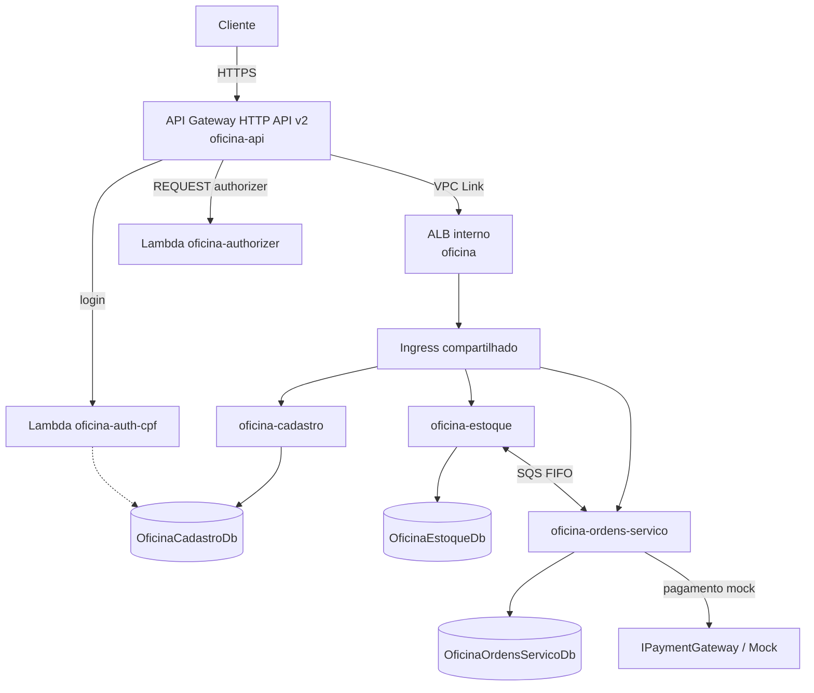
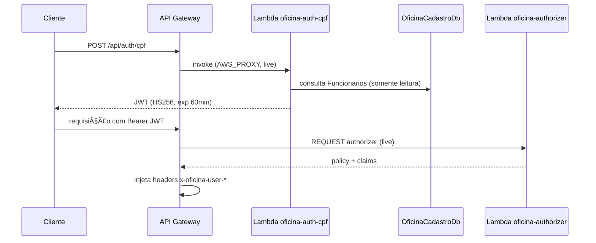
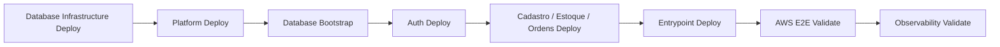

# Oficina

Documentação de entrada da solução Oficina (FIAP Fase 4): oficina de veículos com
cadastro de clientes, controle de estoque e ordens de serviço, expostos por um
único ponto de entrada público e orquestrados sobre EKS.

Este repositório (`oficina-infra-fiap-fase4`) provisiona a plataforma
compartilhada (EKS, ECR, SQS, IAM, addons, observabilidade) e o ponto de
entrada público (API Gateway, VPC Link, ALB interno, Ingress). É o ponto
inicial de leitura da solução.

## Sumário

- [Visão geral](#visão-geral)
- [Arquitetura](#arquitetura)
- [Repositórios](#repositórios)
- [Responsabilidades](#responsabilidades)
- [Fluxos principais](#fluxos-principais)
- [Pré-requisitos](#pré-requisitos)
- [Configuração](#configuração)
- [Ordem de provisionamento](#ordem-de-provisionamento)
- [Validação](#validação)
- [Observabilidade](#observabilidade)
- [Testes E2E](#testes-e2e)
- [Solução de problemas](#solução-de-problemas)

## Visão geral

A solução é composta por três microsserviços .NET independentes (Cadastro,
Estoque, Ordens de Serviço), autenticação por Lambda (CPF/senha + JWT),
mensageria assíncrona via SQS FIFO com Inbox/Outbox e uma Saga orquestrando o
fluxo de ordem de serviço até a entrega, incluindo pagamento. O pagamento usa
um gateway mock determinístico; a integração externa real (Mercado Pago) é uma
pendência de contrato, não uma dependência de execução.

Cada microsserviço mantém banco lógico próprio no mesmo RDS SQL Server,
pipeline própria e deploy independente. Não há uso de banco NoSQL nesta
solução.

## Arquitetura



Camadas de infraestrutura, cada uma com Terraform independente:

| Camada | Repositório | Terraform state |
| ------ | ----------- | ---------------- |
| Rede e banco (VPC, RDS SQL Server) | `oficina-infra-db-fiap-fase4` | `oficina/infra-db/terraform.tfstate` |
| Plataforma (EKS, ECR, SQS, addons, observabilidade) | `oficina-infra-fiap-fase4` | `oficina/platform/terraform.tfstate` |
| Ponto de entrada (API Gateway, VPC Link, Ingress/ALB) | `oficina-infra-fiap-fase4` | `oficina/entrypoint/terraform.tfstate` |
| Autenticação (Lambdas) | `oficina-auth-lambda-fiap-fase4` | `oficina/auth/terraform.tfstate` |

Recursos são descobertos por nome ou tag entre states sempre que seguro (ex.:
ALB por nome, ECR por nome). SSM Parameter Store é usado apenas para valores
que precisam atravessar workflows/execuções distintas (ex.: IDs de rede
publicados pela Infra DB). Não há uso de `terraform_remote_state` em nenhuma
stack.

## Repositórios

| Repositório | Responsabilidade |
| ----------- | ----------------- |
| `oficina-infra-db-fiap-fase4` | VPC, subnets, RDS SQL Server, bootstrap dos bancos e usuários |
| `oficina-infra-fiap-fase4` | EKS, ECR, SQS, addons, observabilidade, entrypoint público (este repositório) |
| `oficina-auth-lambda-fiap-fase4` | Lambdas de autenticação CPF/senha e Authorizer JWT |
| `oficina-cadastro-fiap-fase4` | Domínio de clientes, veículos e catálogo |
| `oficina-estoque-fiap-fase4` | Domínio de estoque, reservas e movimentações |
| `oficina-ordens-servico-fiap-fase4` | Domínio de ordens de serviço, orçamento, Saga e pagamento |

## Responsabilidades

- **Cadastro, Estoque e Ordens de Serviço** são independentes: CI própria,
  deploy próprio, banco lógico próprio, sem acoplamento de código entre si.
- **Auth** emite e valida JWT (HS256); não hospeda regra de negócio de domínio.
- **Infra DB** possui rede e dados; não conhece Kubernetes nem os
  microsserviços.
- **Platform** possui o cluster, os addons e a observabilidade; não conhece
  código de aplicação nem regras de negócio.
- **Entrypoint** (também neste repositório) possui o ponto de entrada público;
  não processa regra de negócio, apenas roteia e autentica.

## Fluxos principais

### Autenticação



### Mensageria (Estoque ↔ Ordens)

```mermaid
sequenceDiagram
    participant Ordens
    participant SQSCmd as SQS oficina-estoque-comandos.fifo
    participant Estoque
    participant SQSEvt as SQS oficina-ordens-eventos.fifo

    Ordens->>SQSCmd: comando (Outbox, mesma transação)
    SQSCmd->>Estoque: consumo (Inbox, idempotente)
    Estoque->>Estoque: reserva/baixa de estoque
    Estoque->>SQSEvt: evento de resultado (Outbox)
    SQSEvt->>Ordens: consumo (Inbox, idempotente)
    Ordens->>Ordens: avança a Saga
```



DLQs FIFO dedicadas para as duas filas; publicação em SQS nunca ocorre dentro
da transação de banco (Outbox garante entrega após commit).

### Saga da ordem de serviço

```mermaid
stateDiagram-v2
    [*] --> AguardandoAprovacao
    AguardandoAprovacao --> ReservaSolicitada: aprovar orçamento
    ReservaSolicitada --> ReservaRecusada: saldo insuficiente
    ReservaSolicitada --> PagamentoSolicitado: reserva confirmada
    PagamentoSolicitado --> Recusado: pagamento recusado
    PagamentoSolicitado --> EmExecucao: pagamento aprovado
    EmExecucao --> Concluida: finalizar + entregar
    ReservaRecusada --> [*]
    Recusado --> Compensada: compensação
    Compensada --> [*]
    Concluida --> [*]
```



Pagamento usa `IPaymentGateway` com implementação mock determinística e
idempotente (`MockPaymentGateway`), sem chamada HTTP externa e sem dependência
de webhook. A integração real (Mercado Pago) é uma pendência de contrato.

## Pré-requisitos

- Conta AWS com credenciais temporárias configuradas nos Repository Secrets
  dos seis repositórios antes de executar qualquer workflow de provisionamento.
- `AWS_REGION` configurada como Repository Variable.
- Terraform 1.10+, .NET 10 SDK, Docker, kubectl e Helm para validação local.

## Configuração

- `config/official.yml`: nomes estáveis e não sensíveis da plataforma
  (cluster, namespace, ECR, addons).
- `config/resource-contract.yml`: caminhos SSM de entrada/saída e nomes dos
  secrets compartilhados, consumidos pelo Terraform.
- `config/solution.yml`: contrato humano da solução (nomes de serviços,
  bancos, filas, entrypoint, sequência de provisionamento) — referência para
  documentação e validações; nenhuma aplicação o lê em runtime.
- `config/entrypoint.json` e `config/ingress-routes.json`: contratos versionados
  do API Gateway e do Ingress compartilhado.

Nenhum destes arquivos contém senha, ARN gerado, URL real de fila/API ou
Account ID.

## Ordem de provisionamento



1. **Database Infrastructure Deploy** (`oficina-infra-db-fiap-fase4`) cria ou
   reconcilia o backend Terraform, provisiona VPC/RDS/SSM/Secrets Manager e
   sincroniza os sete secrets SQL.
2. **Platform Deploy** (`oficina-infra-fiap-fase4`) provisiona EKS, ECR, SQS,
   add-ons e publica outputs em SSM.
3. **Database Bootstrap** (`oficina-infra-db-fiap-fase4`) executa o Job no EKS
   para criar bancos, logins, usuarios e permissoes.
4. **Auth Deploy** (`oficina-auth-lambda-fiap-fase4`) aplica Terraform,
   sincroniza `/oficina/auth/jwt` e publica as Lambdas com alias `live`.
5. **Cadastro Deploy**, **Estoque Deploy**, **Ordens Deploy** permanecem
   independentes e podem rodar em paralelo.
6. **Entrypoint Deploy** (`oficina-infra-fiap-fase4`) aplica o Ingress, aguarda o
   ALB interno e provisiona API Gateway/VPC Link.
7. **AWS E2E Validate** (`oficina-ordens-servico-fiap-fase4`) resolve a API por
   SSM e valida o fluxo principal na AWS com pagamento mock aprovado.
8. **Observability Validate** (`oficina-infra-fiap-fase4`) valida CloudWatch,
   EKS/add-ons e health endpoints sem alterar recursos.

Consulte o README de cada repositório para os comandos específicos de cada
etapa.

## Validação

Validações locais (sem acesso à AWS): `terraform fmt`, `terraform validate`,
`terraform init -backend=false`, `helm lint`/`helm template`, `kubectl apply
--dry-run=client`, PowerShell AST, e as buscas estáticas descritas em cada
workflow de CI.

Validações após provisionamento real: workflows `*-deploy.yml` incluem passos
de validação read-only (health, rotas, filas, Saga) antes de encerrar.

## Observabilidade

- **Logs de aplicacao**: stdout estruturado em pods, consultado via CloudWatch e
  `kubectl logs`.
- **Logs do entrypoint**: API Gateway access logs em CloudWatch.
- **Metricas AWS**: CloudWatch para API Gateway, EKS, RDS e SQS.
- **Saude operacional**: health/readiness dos tres microsservicos, EKS Ready,
  add-ons, ALB interno e VPC Link `AVAILABLE`.

New Relic permanece fora do caminho principal de provisionamento e validacao.

## Testes E2E

O workflow `AWS E2E Validate` (`oficina-ordens-servico-fiap-fase4`) resolve a
URL da API via SSM, gera token bootstrap sem imprimir o `SigningKey`, cria dados
sinteticos unicos, autentica via `/api/auth/cpf` e executa o fluxo principal:
Cadastro, Estoque, abertura de Ordem, aprovacao de Orcamento, pagamento mock
aprovado e reserva de estoque ate a Ordem chegar em `EmExecucao`.

```text
Pagamento mock aprovado: validado
SQS FIFO e health endpoints: validados
Integração externa de pagamentos: pendente de contrato
```

Não há exigência de NoSQL em nenhuma validação, matriz ou README da solução.

## Solução de problemas

- **Terraform plan divergente**: confirme que nenhum recurso foi criado fora
  do Terraform (console, CLI manual); os states não usam
  `terraform_remote_state`, então divergências entre stacks costumam indicar
  um SSM parameter desatualizado.
- **ALB não fica `active`**: verifique se o AWS Load Balancer Controller está
  `Ready` (`Platform Deploy`) antes de rodar `Entrypoint Deploy`.
- **Rota protegida retorna 401/403**: confirme que o Authorizer está usando o
  alias `live` e que o JWT foi emitido pelo mesmo `SigningKey` publicado em
  `/oficina/auth/jwt`.
- **Mensagem presa no Inbox**: consulte `InboxMessages`/`OutboxMessages` no
  banco do serviço; o dispatcher do Outbox não publica dentro da transação
  original, então uma falha de publicação não deixa o banco inconsistente.

## Próximo componente

Siga para [oficina-infra-db-fiap-fase4](../oficina-infra-db-fiap-fase4/README.md)
para provisionar rede e banco.
