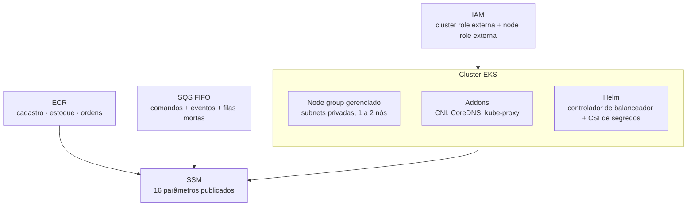
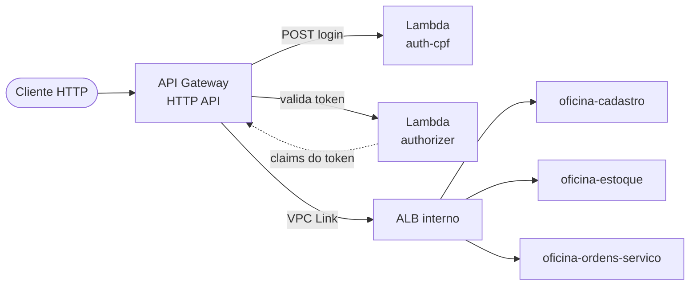

# oficina-infra

> Plataforma compartilhada e ponto de entrada da solução Oficina: cluster EKS, registros de imagem, filas e API Gateway.
> **Terraform** · **AWS** (EKS, ECR, SQS FIFO, API Gateway, IAM) · **Helm** · **GitHub Actions**

---

## A solução

A **Oficina** é uma plataforma de gestão de oficina mecânica distribuída em **6 repositórios** que compõem um único sistema na AWS. O cliente acessa uma API Gateway que autentica na borda e encaminha o tráfego para três microsserviços .NET 10 em EKS, que se comunicam por HTTP e por filas SQS FIFO e persistem em um RDS SQL Server compartilhado.

| Repositório | Responsabilidade |
|---|---|
| [oficina-infra-db](https://github.com/fabianorodrigues/oficina-infra-db-fiap-fase4) | Rede, banco de dados, segredos e estado do Terraform |
| **oficina-infra** *(este)* | Plataforma EKS e entrypoint de API |
| [oficina-auth-lambda](https://github.com/fabianorodrigues/oficina-auth-lambda-fiap-fase4) | Autenticação por CPF e emissão de token |
| [oficina-cadastro](https://github.com/fabianorodrigues/oficina-cadastro-fiap-fase4) | Clientes, veículos, funcionários e catálogo de serviços |
| [oficina-estoque](https://github.com/fabianorodrigues/oficina-estoque-fiap-fase4) | Peças, insumos, saldos e reservas |
| [oficina-ordens-servico](https://github.com/fabianorodrigues/oficina-ordens-servico-fiap-fase4) | Ordens de serviço, orçamento e saga de pagamento |

---

## Ordem de deploy

| # | Repositório | Workflow | Confirmação |
|---|---|---|---|
| 1 | oficina-infra-db | Database Infrastructure Deploy | `APPLY` |
| **2** | **oficina-infra** | **Platform Deploy** | `APPLY` |
| 3 | oficina-infra-db | Database Bootstrap | `BOOTSTRAP` |
| 4 | oficina-auth-lambda | Auth Deploy | `DEPLOY` |
| 5 | cadastro · estoque · ordens-servico | Deploy | `DEPLOY` |
| **6** | **oficina-infra** | **Entrypoint Deploy** | `APPLY` |
| **7** | **oficina-infra** | **Observability Validate** | `VALIDATE` |
| 8 | oficina-ordens-servico | AWS E2E Validate | `VALIDATE` |

> **Este repositório contém dois stacks independentes, executados em momentos distintos.** O **Platform Deploy** (etapa 2) cria a infraestrutura que os serviços precisam para existir. O **Entrypoint Deploy** (etapa 6) só pode rodar **depois** que as Lambdas de autenticação e os três microsserviços estiverem no ar, porque publica as rotas que apontam para eles e valida a saúde de cada destino antes de aplicar.

---

## Responsabilidade

### Stack `platform` — etapa 2

| Recurso | Detalhe |
|---|---|
| **EKS** | Cluster e namespace da aplicação, com logs de painel de controle habilitados |
| **Node group** | Grupo gerenciado em subnets privadas, sob demanda, escala de 1 a 2 nós |
| **Addons** | VPC CNI, CoreDNS e kube-proxy; agente de Pod Identity somente quando houver role específica opcional |
| **Helm** | Controlador de balanceador, driver CSI de segredos e o provedor AWS do CSI |
| **ECR** | 3 repositórios de imagem, com tags imutáveis, varredura ao enviar e retenção das 20 últimas |
| **SQS** | 4 filas FIFO — comandos e eventos, cada uma com sua fila de mensagens mortas |
| **IAM** | Roles externas para cluster e node group; controller e workloads usam credenciais da node role |

### Stack `entrypoint` — etapa 6

| Recurso | Detalhe |
|---|---|
| **Ingress e ALB** | Balanceador interno criado via Kubernetes, não exposto à internet |
| **API Gateway** | HTTP API com estágio padrão, publicação automática e limite de requisições |
| **VPC Link** | Ligação privada entre a API Gateway e o balanceador interno |
| **Authorizer** | Autorizador Lambda do tipo requisição, sem cache de resultado |
| **Rotas** | Rotas explícitas por recurso — não há rota curinga |
| **Log group** | Log de acesso da API com retenção de 14 dias e campos sensíveis omitidos |

---

## Arquitetura

### Plataforma (etapa 2)



### Entrypoint (etapa 6)



O autorizador valida o token na borda e devolve as claims. A API Gateway as converte em cabeçalhos de identidade (`x-oficina-user-id`, `x-oficina-user-cpf`, `x-oficina-user-role`, `x-oficina-user-name`, `x-oficina-token-jti`) e os injeta na requisição encaminhada ao balanceador. Os três serviços materializam esses cabeçalhos como claims e aplicam suas políticas de autorização por perfil.

Esse desenho concentra a validação do token em um único ponto: os serviços não lidam com chave de assinatura nem com expiração. Em contrapartida, os cabeçalhos só são confiáveis enquanto o balanceador permanecer interno e o acesso restrito ao VPC Link — a regra de entrada não deve ser ampliada.

---

## Contrato de integração

### Consome

| Origem | Valores |
|---|---|
| oficina-infra-db | VPC, subnets públicas e privadas, grupo de segurança e segredo master do RDS |
| oficina-infra-db | Os 7 segredos de banco, que precisam existir antes do Platform Deploy |
| oficina-auth-lambda | Nome e alias das duas funções de autenticação *(apenas no Entrypoint Deploy)* |

### Publica

| Recurso | Caminho | Consumido por |
|---|---|---|
| Cluster | `/oficina/infra/cluster/{name,namespace,arn,endpoint,security-group-id}` | os três serviços, bootstrap, auth |
| Registros de imagem | `/oficina/infra/ecr/{cadastro,estoque,ordens}` | os três serviços |
| Filas de comandos | `/oficina/infra/sqs/estoque-comandos/{url,arn}` e a fila morta correspondente | estoque, ordens |
| Filas de eventos | `/oficina/infra/sqs/ordens-eventos/{url,arn}` e a fila morta correspondente | estoque, ordens |
| API | `/oficina/infra/api/{id,url,execution-arn,stage,vpc-link-id}` | validação ponta a ponta |

O acoplamento entre repositórios é feito **por nome de parâmetro no SSM**. Não há leitura de estado entre stacks: cada stack lê apenas o que o anterior publicou.

---

## Configuração

Configure em **Repository → Settings → Secrets and variables → Actions** do repositório.

### Secrets (obrigatórios)

| Secret | Uso |
|---|---|
| `AWS_ACCESS_KEY_ID` · `AWS_SECRET_ACCESS_KEY` · `AWS_SESSION_TOKEN` | Credenciais temporárias da AWS |

### Variables

| Variable | Obrigatória | Uso |
|---|---|---|
| `AWS_REGION` | **Sim** | Região de todos os recursos. Os workflows abortam se estiver vazia |
| `TF_STATE_BUCKET` | Não | Apenas compatibilidade com um bucket de estado pré-existente |
| `PLATFORM_IAM_ROLES_JSON` | Sim, quando o Platform Deploy reutilizar roles externas | ARNs das roles externas do cluster e do node group |

### Roles IAM externas

Configure `PLATFORM_IAM_ROLES_JSON` como **Repository Variable** para reutilizar a cluster role externa e a node role externa. ARN de role não é secret.

```json
{
  "eks_cluster_role_arn": "<ARN_DA_ROLE_DO_CLUSTER>",
  "eks_node_group_role_arn": "<ARN_DA_ROLE_DO_NODE_GROUP>"
}
```

Com essas duas ARNs, o EKS usa roles externas para o cluster e os nodes. O AWS Load Balancer Controller, os serviços, os migrators e o bootstrap dos bancos usam as credenciais da node role pela cadeia padrão de credenciais AWS. Nenhuma role adicional de Pod Identity é obrigatória.

Campos opcionais `load_balancer_controller_role_arn` e `workload_role_arn` continuam aceitos para uso futuro com Pod Identity. Quando eles não são informados, o Terraform não cria role, policy, attachment, associação Pod Identity, OIDC provider ou annotation IRSA para esses componentes.

| Campo | Obrigatório quando | Componente | Trust esperado |
|---|---|---|---|
| `eks_cluster_role_arn` | O Platform Deploy reutilizar role externa | EKS cluster | `eks.amazonaws.com` com `sts:AssumeRole` |
| `eks_node_group_role_arn` | O Platform Deploy reutilizar role externa | EKS node group, controller, workloads, migrators e bootstrap | `ec2.amazonaws.com` com `sts:AssumeRole` |

Obtenha o ARN de uma role existente com:

```powershell
aws iam get-role `
  --role-name "<ROLE_NAME>" `
  --query "Role.Arn" `
  --output text
```

A node role precisa manter as permissões base dos nodes EKS, pull de imagens no ECR, leitura dos segredos e parâmetros usados pelos pods, ações SQS dos serviços e permissões core da policy oficial do AWS Load Balancer Controller v3.4.1 para criar e reconciliar ALB, target groups, listeners, listener rules, tags e security groups. Caso segredos ou parâmetros usem chave KMS gerenciada pela conta, inclua também a descriptografia necessária.

Essa configuração é mais simples e compatível com contas com IAM restrito, porque o Platform Deploy não precisa criar roles adicionais para pods. O trade-off é menor isolamento: controller, serviços, migrators e bootstrap compartilham as permissões da node role. Para produção, prefira uma role por workload via Pod Identity ou IRSA quando a conta permitir esse desenho.

### O que é provisionado automaticamente

Toda a infraestrutura deste repositório é criada pelos workflows, e **todas as variáveis do Terraform têm valor padrão**. Nesta estratégia, o Platform Deploy deve ser executado com `PLATFORM_IAM_ROLES_JSON` apontando para uma cluster role externa e uma node role externa compatível. Para AWS Load Balancer Controller e workloads, a ausência de role específica significa uso das credenciais da node role. O chart do AWS Load Balancer Controller fica fixado por padrão em `3.4.1`; os demais charts opcionais ficam em branco para que o Helm resolva a versão mais recente.

A forma dos recursos vem dos arquivos em `config/` (nomes, dimensionamento do node group, retenção do ECR, tempos das filas, rotas da API), versionados junto ao código. Ajustes de plataforma são feitos por pull request nesses arquivos, não por variables do GitHub.

> **Pré-requisito não provisionado aqui:** o bucket S3 de estado do Terraform. Ele é criado na **etapa 1**, pelo `Database Infrastructure Deploy` do repositório [oficina-infra-db](https://github.com/fabianorodrigues/oficina-infra-db-fiap-fase4). Os workflows deste repositório verificam a existência do bucket e **falham imediatamente** se ele não existir. Os 7 segredos de banco e os 7 parâmetros de rede da etapa 1 também são verificados antes do plano.

---

## Executar pelo GitHub Actions

Todos os workflows rodam apenas na branch `main` e exigem uma string de confirmação **sensível a maiúsculas**.

### Platform Deploy — etapa 2

**Actions → Platform Deploy → Run workflow → `confirmation` = `APPLY`**

Verifica o bucket de estado e os parâmetros da etapa 1 → valida o plano → aplica → aguarda o cluster e os nós ficarem ativos → confere addons e releases Helm. Um passo de segurança **interrompe o deploy se o plano previr exclusão ou substituição** de cluster, node group, repositório de imagem, fila, papel IAM, parâmetro ou segredo.

Duração típica: 20 a 35 minutos, dominada pela criação do cluster.

### Entrypoint Deploy — etapa 6

Execute **apenas depois** das etapas 4 e 5. O workflow tem duas fases em uma única execução:

1. **Ingress** — confere que os três serviços respondem no cluster, aplica o Ingress, aguarda o balanceador ficar ativo e todos os destinos saudáveis.
2. **API Gateway** — confere que as Lambdas têm o alias publicado, aplica o stack e aguarda o VPC Link ficar disponível.

**Actions → Entrypoint Deploy → Run workflow → `confirmation` = `APPLY`**

Se a fase 1 falhar por destino não saudável, a causa quase sempre está na etapa 5: algum serviço não subiu ou não passou na verificação de saúde.

### Observability Validate — etapa 7

**Actions → Observability Validate → Run workflow → `confirmation` = `VALIDATE`**

Somente leitura — não altera nada. Verifica o cluster, os addons, os nós, os deployments, a existência dos grupos de log e responde às verificações de saúde dos três serviços pela API pública.

---

## Validar

### Pelo Console AWS

| Serviço | O que verificar |
|---|---|
| **EKS** | Cluster `Active`, node group `Active`, addons base `Active`; Pod Identity Agent apenas quando houver role específica opcional |
| **ECR** | 3 repositórios, com imagem enviada após a etapa 5 |
| **SQS** | 4 filas FIFO, cada fila principal com política de redirecionamento para a fila morta |
| **API Gateway** | HTTP API com estágio padrão, autorizador do tipo requisição e VPC Link `Available` |
| **EC2 → Load Balancers** | Balanceador com esquema **interno** e destinos saudáveis |
| **CloudWatch → Log groups** | Log de acesso da API presente |

### Pela AWS CLI

<details>
<summary>Comandos de validação</summary>

```bash
REGIAO=<sua-regiao>
CLUSTER=$(aws ssm get-parameter --name /oficina/infra/cluster/name \
  --region "$REGIAO" --query 'Parameter.Value' --output text)

# Cluster e nós
aws eks describe-cluster --name "$CLUSTER" --region "$REGIAO" \
  --query 'cluster.status' --output text
aws eks update-kubeconfig --name "$CLUSTER" --region "$REGIAO"
kubectl get nodes
kubectl get pods -n oficina

# Filas FIFO
aws sqs list-queues --region "$REGIAO" --query 'QueueUrls' --output table

# Parâmetros publicados
aws ssm get-parameters-by-path --path /oficina/infra --recursive \
  --region "$REGIAO" --query 'Parameters[].Name' --output table

# Verificação de saúde pela API pública (após a etapa 6)
API=$(aws ssm get-parameter --name /oficina/infra/api/url \
  --region "$REGIAO" --query 'Parameter.Value' --output text)
for s in cadastro estoque ordens; do
  echo "$s -> $(curl -s -o resposta.tmp -w '%{http_code}' "$API/health/$s")"
done
rm -f resposta.tmp
```

</details>

---

## Observabilidade

O que está efetivamente ativo hoje:

| Sinal | Onde |
|---|---|
| Log de acesso da API | Grupo de log da API Gateway, retenção de 14 dias, sem token, corpo ou dados pessoais |
| Logs do painel de controle do EKS | Grupo de log do cluster |
| Logs das Lambdas | Um grupo de log por função, retenção de 14 dias |
| Rastreamento distribuído | X-Ray ativo nas Lambdas de autenticação |
| Métricas | Métricas detalhadas do estágio da API e métricas padrão de EKS, RDS e SQS |

Use o **Observability Validate** (etapa 7) para conferir automaticamente que cluster, grupos de log e verificações de saúde estão íntegros.

> **Estado atual:** o coletor OpenTelemetry e o agente de APM existem como código Helm neste repositório, mas estão **desligados por configuração** e não são implantados. Também **não há painéis, alarmes, tópicos de notificação nem Container Insights**. A observabilidade em vigor é a descrita na tabela acima.

---

## Executar localmente

Não há execução local de infraestrutura: alterações são aplicadas apenas pelos workflows, para manter o estado do Terraform consistente. A validação estática local reproduz o que a CI executa:

```bash
# Plataforma
cd terraform/platform
terraform fmt -check -recursive
terraform init -backend=false
terraform validate

# Entrypoint
cd ../entrypoint
terraform init -backend=false
terraform validate
```

A CI adiciona análise de lint, verificação de política, renderização dos manifestos contra um cluster descartável e checagens de segurança estática. Nenhum recurso da AWS é acessado em pull request.

---

## Limitações conhecidas

- **Sem aprovação manual nos deploys.** O controle é a branch `main` mais a string de confirmação; não há GitHub Environments nem revisores obrigatórios.
- **Credenciais estáticas.** Os workflows usam chave de acesso com token de sessão em vez de federação OIDC.
- **Node group pequeno e sem escala automática de pods.** De 1 a 2 nós, e os serviços rodam com réplica única por decisão de projeto.
- **Sem pipeline de remoção.** A retirada dos recursos não é automatizada, e as verificações de segurança bloqueiam operações destrutivas nos workflows.

---

## Próxima etapa

- Após o **Platform Deploy** (etapa 2) → volte a [oficina-infra-db](https://github.com/fabianorodrigues/oficina-infra-db-fiap-fase4) para o **Database Bootstrap** (etapa 3).
- Após o **Entrypoint Deploy** (etapa 6) → execute o **Observability Validate** (etapa 7) e conclua em [oficina-ordens-servico](https://github.com/fabianorodrigues/oficina-ordens-servico-fiap-fase4) com o **AWS E2E Validate** (etapa 8).
