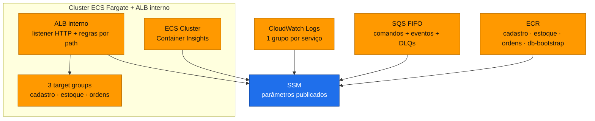
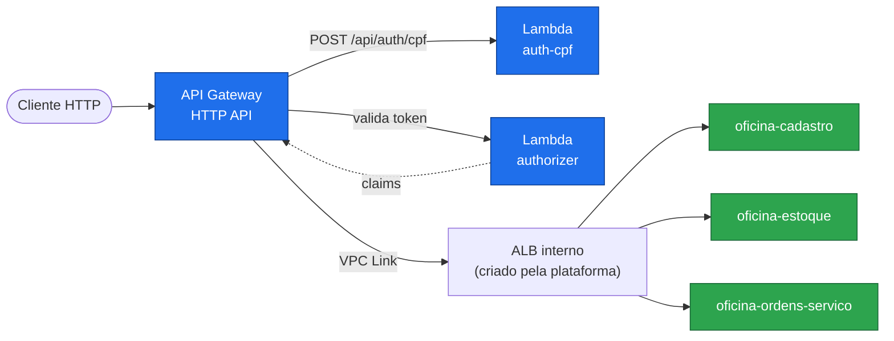

# oficina-infra

Plataforma compartilhada e ponto de entrada da solução **Oficina**: cluster **ECS Fargate**, **ALB interno**, registros de imagem, filas e **API Gateway**.


---

## Sumário

- [Visão geral](#visão-geral)
- [Ordem de deploy da solução](#ordem-de-deploy-da-solução)
- [Arquitetura](#arquitetura)
- [O que consome e o que publica](#o-que-consome-e-o-que-publica)
- [Configuração](#configuração)
- [Como executar](#como-executar)
- [Validação](#validação)
- [Observabilidade](#observabilidade)
- [Execução local](#execução-local)
- [Limitações conhecidas](#limitações-conhecidas)
- [Próximas etapas](#próximas-etapas)

---

## Visão geral

A **Oficina** é uma plataforma de gestão de oficina mecânica implantada na AWS e distribuída em **6 repositórios** que compõem um único sistema. O cliente acessa uma **API Gateway HTTP**, que autentica na borda por uma **Lambda authorizer** e encaminha o tráfego, via **VPC Link**, para um **ALB interno** que roteia para três microsserviços **.NET 10 em ECS Fargate**. Os serviços se comunicam por HTTP interno e por filas **SQS FIFO**, e persistem em um **RDS SQL Server** compartilhado.

| Repositório | Responsabilidade | Etapas |
|---|---|:---:|
| [oficina-infra-db](https://github.com/fabianorodrigues/oficina-infra-db-fiap-fase4) | Rede, banco de dados, segredos e estado do Terraform | 1 e 3 |
| **oficina-infra** *(este)* | Plataforma ECS/ALB e entrada de API | 2, 6 e 7 |
| [oficina-auth-lambda](https://github.com/fabianorodrigues/oficina-auth-lambda-fiap-fase4) | Autenticação por CPF e validação de token | 4 |
| [oficina-cadastro](https://github.com/fabianorodrigues/oficina-cadastro-fiap-fase4) | Clientes, veículos, funcionários e catálogo de serviços | 5 |
| [oficina-estoque](https://github.com/fabianorodrigues/oficina-estoque-fiap-fase4) | Peças, insumos, saldos e reservas | 5 |
| [oficina-ordens-servico](https://github.com/fabianorodrigues/oficina-ordens-servico-fiap-fase4) | Ordens de serviço, orçamento e saga de pagamento | 5 e 8 |

**Papel deste repositório:** contém dois stacks Terraform independentes. O **`platform`** (etapa 2) cria a infraestrutura onde os serviços rodam. O **`entrypoint`** (etapa 6) cria a fachada pública da API, que só pode ser aplicada depois que as Lambdas de autenticação e os três serviços estiverem no ar.

---

## Ordem de deploy da solução

| # | Repositório | Workflow | Confirmação |
|:---:|---|---|:---:|
| 1 | oficina-infra-db | Database Infrastructure Deploy | `APPLY` |
| **2** | **oficina-infra** | **Platform Deploy** | `APPLY` |
| 3 | oficina-infra-db | Database Bootstrap | `BOOTSTRAP` |
| 4 | oficina-auth-lambda | Auth Deploy | `DEPLOY` |
| 5 | cadastro · estoque · ordens-servico | Deploy | `DEPLOY` |
| **6** | **oficina-infra** | **Entrypoint Deploy** | `APPLY` |
| **7** | **oficina-infra** | **Observability Validate** | — |
| 8 | oficina-ordens-servico | AWS E2E Validate | `VALIDATE` |

> [!IMPORTANT]
> O **Platform Deploy** (etapa 2) cria o cluster ECS, o ALB e os *target groups*, mas **não cria os serviços** — cada serviço se registra no seu *target group* ao ser publicado na etapa 5. O **Entrypoint Deploy** (etapa 6) valida a saúde de cada destino antes de aplicar, por isso só roda **depois** das etapas 4 e 5.

---

## Arquitetura

### Stack `platform` — etapa 2



Cria: cluster ECS, ALB interno (listener HTTP, regras de roteamento por path e por *header* de saúde), *target groups* por serviço, grupos de segurança (ALB, tasks ECS e acesso das tasks ao RDS), grupos de log, 4 repositórios ECR (imutáveis, com varredura ao enviar e retenção das 20 últimas imagens) e 4 filas SQS FIFO (comandos e eventos, cada uma com sua *dead-letter queue*).

### Stack `entrypoint` — etapa 6



O autorizador valida o token na borda e devolve as *claims*. A API Gateway as converte em cabeçalhos de identidade (`x-oficina-user-id`, `x-oficina-user-cpf`, `x-oficina-user-role`, `x-oficina-user-name`, `x-oficina-token-jti`) e os injeta na requisição encaminhada ao ALB. Os cabeçalhos são confiáveis porque o balanceador é interno e o acesso está restrito ao VPC Link. As rotas são explícitas por recurso — não há rota curinga.

---

## O que consome e o que publica

### Consome

| Origem | Valores | Usado em |
|---|---|---|
| oficina-infra-db | VPC, subnets, grupo de segurança e segredos de banco | Platform Deploy |
| oficina-auth-lambda | Nome e alias `live` das duas funções de autenticação | Entrypoint Deploy |

### Publica

| Recurso | Caminho | Consumido por |
|---|---|---|
| Cluster ECS | `/oficina/infra/cluster/{name,arn}` | serviços, bootstrap |
| Grupo de segurança das tasks | `/oficina/infra/ecs/task-security-group-id` | serviços, bootstrap |
| ALB interno | `/oficina/infra/alb/{name,arn,dns-name,listener-arn,security-group-id}` | serviços, entrypoint |
| Target groups | `/oficina/infra/ecs/{cadastro,estoque,ordens}/target-group-arn` | serviços |
| Grupos de log | `/oficina/infra/ecs/{cadastro,estoque,ordens}/log-group-name` | serviços |
| Registros de imagem | `/oficina/infra/ecr/{cadastro,estoque,ordens,db-bootstrap}` | serviços, bootstrap |
| Filas SQS | `/oficina/infra/sqs/{estoque-comandos,ordens-eventos}[-dlq]/{url,arn}` | estoque, ordens |
| API Gateway | `/oficina/infra/api/{id,url,execution-arn,stage,vpc-link-id}` | validação ponta a ponta |

O acoplamento é feito **por nome de parâmetro no SSM**. Cada stack lê apenas o que o anterior publicou.

---

## Configuração

Configure em **Settings → Secrets and variables → Actions** do repositório.

### Secrets

| Secret | Uso | Obrigatório |
|---|---|:---:|
| `AWS_ACCESS_KEY_ID` · `AWS_SECRET_ACCESS_KEY` · `AWS_SESSION_TOKEN` | Credenciais temporárias da AWS | **Sim** |

### Variables

| Variable | Uso | Obrigatório |
|---|---|:---:|
| `AWS_REGION` | Região de todos os recursos. Os workflows abortam se estiver vazia | **Sim** |
| `TF_STATE_BUCKET` | Compatibilidade com um bucket de estado pré-existente | Não |

### O que é provisionado automaticamente

Toda a infraestrutura deste repositório é criada pelos workflows, e **todas as variáveis do Terraform têm valor padrão**. A forma dos recursos (nomes, portas, retenção do ECR, tempos das filas, rotas da API) vem dos arquivos em `config/`, versionados junto ao código — ajustes são feitos por pull request, não por *variables* do GitHub.

> [!NOTE]
> O stack `platform` **não cria papéis IAM**. Os serviços ECS assumem as roles de execução e de aplicação informadas nos próprios deploys de cadastro, estoque e ordens (variáveis `ECS_TASK_EXECUTION_ROLE_ARN` e `ECS_TASK_ROLE_ARN`, documentadas naqueles repositórios).

> [!WARNING]
> **Pré-requisito não provisionado aqui:** o bucket S3 de estado do Terraform, criado na **etapa 1** por [oficina-infra-db](https://github.com/fabianorodrigues/oficina-infra-db-fiap-fase4). Os workflows deste repositório verificam sua existência e **falham imediatamente** se ele não existir. Os segredos e parâmetros da etapa 1 também são verificados antes do plano.

---

## Como executar

Todos os workflows rodam apenas na branch `main` e exigem uma confirmação **sensível a maiúsculas**.

### Etapa 2 — Platform Deploy

**Actions → Platform Deploy → Run workflow → `confirmation` = `APPLY`**

Verifica o bucket de estado e os parâmetros da etapa 1 → valida o plano → aplica → confirma que o cluster está `ACTIVE`, o ALB é interno e os *target groups* e grupos de log existem. Um passo de segurança **interrompe o deploy se o plano previr exclusão** de cluster, ALB, *target group*, listener, ECR, fila, grupo de segurança, grupo de log ou parâmetro.

Duração típica: 5 a 10 minutos.

### Etapa 6 — Entrypoint Deploy

Execute **apenas depois** das etapas 4 e 5.

**Actions → Entrypoint Deploy → Run workflow → `confirmation` = `APPLY`**

Valida o ALB da plataforma (interno, listener HTTP, *target groups*) e as Lambdas de autenticação (com alias `live`) → valida o plano → aplica a API Gateway, o VPC Link e as integrações → aguarda o VPC Link ficar `AVAILABLE` → executa validação somente leitura e teste de fumaça na API. Se falhar por destino não saudável, a causa quase sempre está na etapa 5.

### Etapa 7 — Observability Validate

**Actions → Observability Validate → Run workflow**

Não exige confirmação e é **somente leitura**. Verifica o cluster ECS, a existência dos grupos de log (serviços, bootstrap e API Gateway) e a presença das métricas de ECS e do ALB no CloudWatch.

---

## Validação

### Pelo Console AWS

| Serviço | O que verificar |
|---|---|
| **ECS** | Cluster `ACTIVE` com Container Insights; após a etapa 5, 3 serviços com tasks em execução |
| **EC2 → Load Balancers** | ALB com esquema **interno** e destinos saudáveis |
| **ECR** | 4 repositórios, com imagem enviada após as etapas 3 e 5 |
| **SQS** | 4 filas FIFO, cada fila principal com política de redirecionamento para a DLQ |
| **API Gateway** | HTTP API com estágio padrão, autorizador do tipo requisição e VPC Link `Available` |
| **CloudWatch → Log groups** | Grupos `/ecs/oficina/*` e `/aws/apigateway/oficina-api` presentes |

### Pela AWS CLI

<details>
<summary>Comandos de validação</summary>

```bash
REGIAO=<sua-regiao>

# Cluster e serviços ECS
CLUSTER=$(aws ssm get-parameter --name /oficina/infra/cluster/name \
  --region "$REGIAO" --query 'Parameter.Value' --output text)
aws ecs describe-clusters --clusters "$CLUSTER" --region "$REGIAO" \
  --query 'clusters[0].status' --output text
aws ecs list-services --cluster "$CLUSTER" --region "$REGIAO" --output table

# ALB interno e saúde dos destinos
for s in cadastro estoque ordens; do
  TG=$(aws ssm get-parameter --name "/oficina/infra/ecs/$s/target-group-arn" \
    --region "$REGIAO" --query 'Parameter.Value' --output text)
  echo -n "$s -> "
  aws elbv2 describe-target-health --target-group-arn "$TG" --region "$REGIAO" \
    --query 'TargetHealthDescriptions[].TargetHealth.State' --output text
done

# Verificação de saúde pela API pública (após a etapa 6)
API=$(aws ssm get-parameter --name /oficina/infra/api/url \
  --region "$REGIAO" --query 'Parameter.Value' --output text)
for s in cadastro estoque ordens; do
  echo "$s -> $(curl -s -o /dev/null -w '%{http_code}' "$API/health/$s")"
done
```

</details>

---

## Observabilidade

O que está efetivamente ativo hoje:

| Sinal | Onde |
|---|---|
| Logs das tasks ECS | Grupos `/ecs/oficina/{cadastro,estoque,ordens,db-bootstrap}` |
| Log de acesso da API | Grupo `/aws/apigateway/oficina-api`, retenção de 14 dias, sem dados sensíveis |
| Métricas de contêiner | Container Insights no cluster ECS |
| Métricas de plataforma | `AWS/ECS` e `AWS/ApplicationELB` no CloudWatch |
| Rastreamento distribuído | X-Ray nas Lambdas de autenticação |

> [!NOTE]
> **Não há painéis, alarmes, tópicos de notificação nem coletor OpenTelemetry.** A observabilidade em vigor é a descrita acima. Use o **Observability Validate** (etapa 7) para conferir automaticamente que cluster, grupos de log e métricas estão presentes.

---

## Execução local

Não há execução local de infraestrutura: alterações são aplicadas apenas pelos workflows. A validação estática local reproduz o que a CI executa:

```bash
# Plataforma
cd terraform/platform
terraform fmt -check -recursive
terraform init -backend=false
terraform validate

# Entrypoint
cd ../entrypoint
terraform init -backend=false
terraform validate
```

---

## Limitações conhecidas

- **Sem aprovação manual nos deploys.** O controle é a branch `main` mais a confirmação; não há GitHub Environments nem revisores obrigatórios.
- **Credenciais estáticas** com token de sessão, em vez de federação OIDC.
- **Serviços com réplica única** (`desiredCount = 1`), sem escala automática, por decisão de projeto.
- **Sem pipeline de remoção.** As verificações de segurança bloqueiam operações destrutivas nos workflows.

---

## Próximas etapas

- Após o **Platform Deploy** (etapa 2) → volte a [oficina-infra-db](https://github.com/fabianorodrigues/oficina-infra-db-fiap-fase4) para o **Database Bootstrap** (etapa 3).
- Após o **Entrypoint Deploy** (etapa 6) → execute o **Observability Validate** (etapa 7) e conclua em [oficina-ordens-servico](https://github.com/fabianorodrigues/oficina-ordens-servico-fiap-fase4) com o **AWS E2E Validate** (etapa 8).
