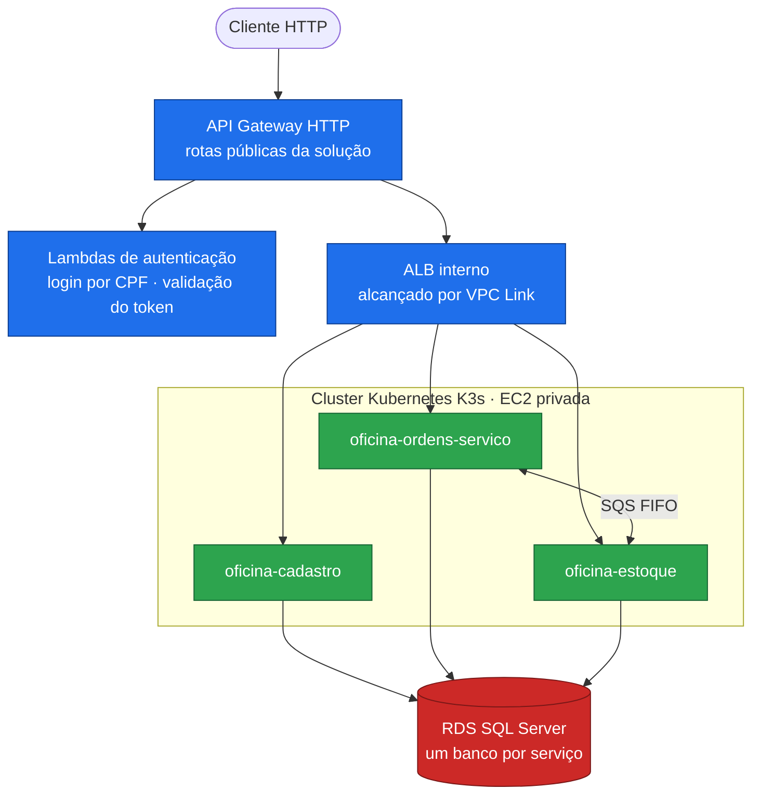
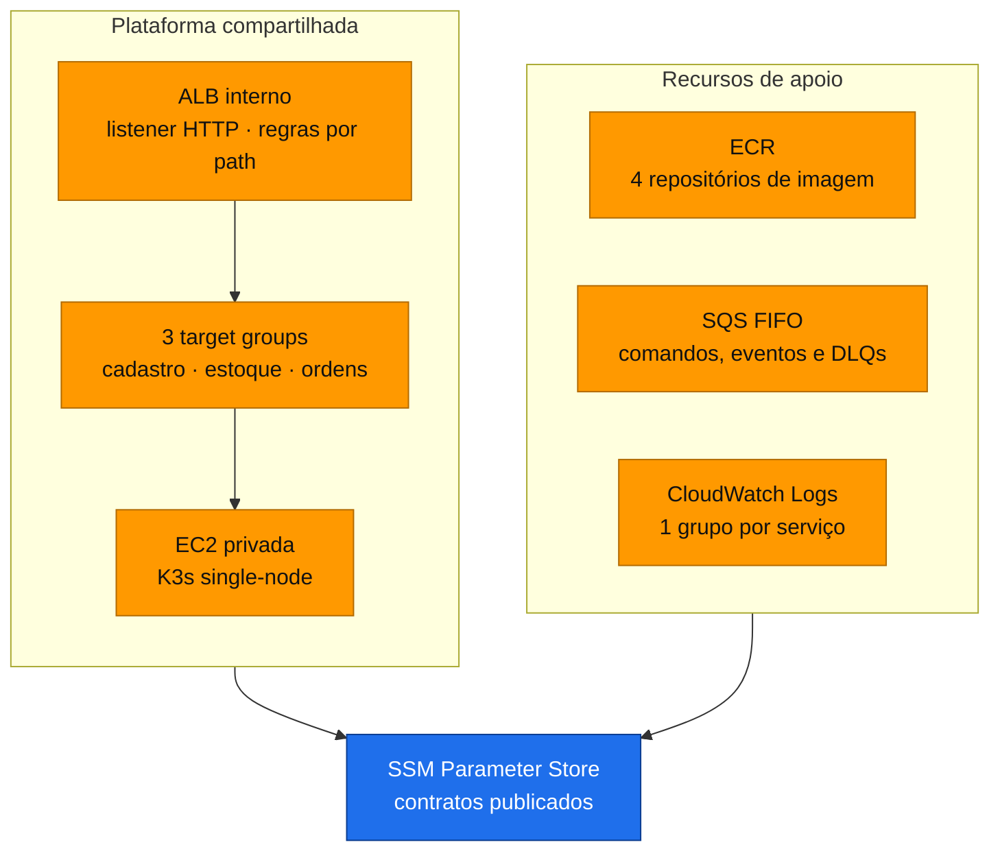
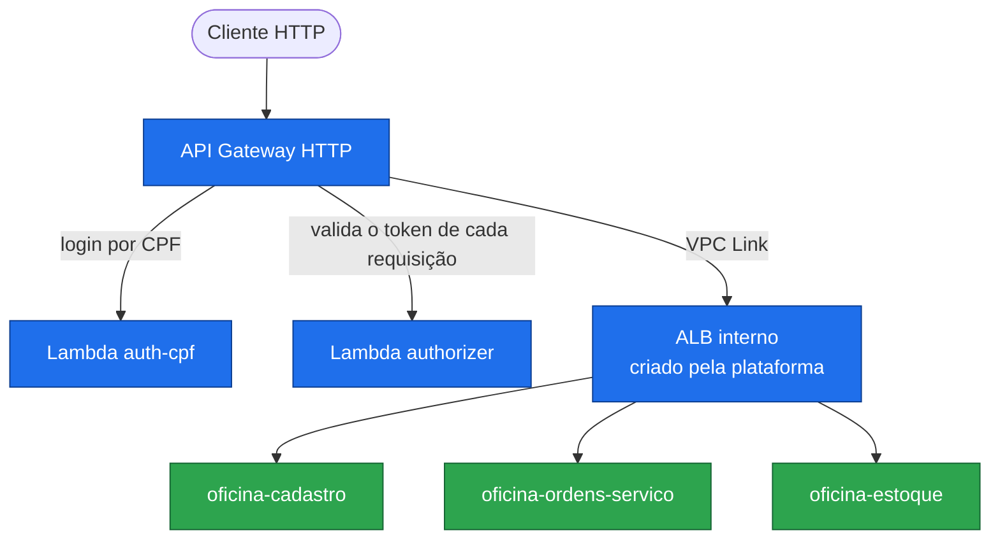

<h1 align="center">Oficina · Plataforma e Entrada da API</h1>

<p align="center">
  Plataforma compartilhada e fachada pública da solução <strong>Oficina</strong>:
  cluster Kubernetes, ALB interno, registros de imagem, filas, API Gateway e observabilidade.
</p>

<p align="center">
  
  
  
  
  
  
</p>

<p align="center">
  <a href="https://jaquelineramosit.github.io/oficina-docs/"></a>
  <a href="https://youtu.be/SYXeLpUZaiA"></a>
</p>

---

## Sumário

- [Documentação e demonstração](#documentação-e-demonstração)
- [Responsabilidade](#responsabilidade)
- [Solução integrada](#solução-integrada)
- [Ordem de deploy](#ordem-de-deploy)
- [Arquitetura](#arquitetura)
- [Pré-requisitos manuais](#pré-requisitos-manuais)
- [Contratos consumidos e publicados](#contratos-consumidos-e-publicados)
- [Como configurar](#como-configurar)
- [Como executar](#como-executar)
- [Como validar](#como-validar)
- [Validação local](#validação-local)
- [Observabilidade](#observabilidade)
- [Próxima etapa](#próxima-etapa)

---

## Documentação e demonstração

A solução **Oficina** tem documentação oficial e um vídeo de demonstração que percorrem a **configuração, o provisionamento e a validação** de ponta a ponta, na sequência das 11 etapas.

| Recurso | Conteúdo |
|---|---|
| **[Documentação oficial](https://jaquelineramosit.github.io/oficina-docs/)** | Guia completo da solução: arquitetura, configuração dos repositórios, provisionamento na AWS e validação do ambiente publicado |
| **[Vídeo de demonstração](https://youtu.be/SYXeLpUZaiA)** | Execução guiada da configuração, do provisionamento e da validação da solução |
---

## Responsabilidade

Três entregas independentes, executadas em momentos diferentes da sequência.

| Entrega | Etapa | Conteúdo |
|---|:---:|---|
| Stack `platform` | **2** | EC2 privada com K3s, ALB interno, target groups, grupos de segurança, repositórios ECR, filas SQS FIFO e grupos de log |
| Stack `entrypoint` | **9** | API Gateway HTTP, VPC Link, autorizador na borda e rotas explícitas por recurso |
| Observabilidade | **10** | Collector OpenTelemetry no cluster, dashboard, políticas de alerta, monitores sintéticos e validação de sinais |

A plataforma cria a infraestrutura onde os serviços rodam, mas **não cria workloads**: cada serviço registra a si mesmo no seu target group ao ser publicado. O entrypoint só pode ser aplicado depois que as Lambdas de autenticação e os três serviços estiverem no ar.

| Item | Valor |
|---|---|
| Versão do K3s | `v1.35.6+k3s1`, fonte única em `config/official.yml` |
| Acesso operacional ao node | Exclusivamente por Systems Manager — sem SSH, sem chave e sem IP público |
| Health check dos target groups | `/ready`, com `target_type = instance` |
| Registros de imagem | 4 repositórios ECR, imutáveis, com varredura ao enviar e retenção das 20 últimas imagens |
| Filas | 4 filas SQS FIFO: comandos e eventos, cada uma com sua *dead-letter queue* |

---

## Solução integrada

A **Oficina** é uma plataforma de gestão de oficina mecânica implantada na AWS e distribuída em **6 repositórios que formam um único sistema**. O cliente acessa uma **API Gateway HTTP**, autenticada na borda por **Lambdas**; o tráfego segue por **VPC Link** até um **ALB interno**, que roteia para três microsserviços **.NET 10** em **Kubernetes (K3s)**. Os serviços conversam por HTTP interno e por **filas SQS FIFO**, e persistem em um **RDS SQL Server** com um banco isolado por serviço.


```mermaid
flowchart TB
    Cliente([Cliente HTTP])
    Gateway["API Gateway HTTP<br/>rotas públicas da solução"]
    Auth["Lambdas de autenticação<br/>login por CPF · validação do token"]
    ALB["ALB interno<br/>alcançado por VPC Link"]

    subgraph Cluster["Cluster Kubernetes K3s · EC2 privada"]
        direction LR
        Cadastro["oficina-cadastro"]
        Ordens["oficina-ordens-servico"]
        Estoque["oficina-estoque"]
    end

    Banco[("RDS SQL Server<br/>um banco por serviço")]

    Cliente --> Gateway
    Gateway --> Auth
    Gateway --> ALB
    ALB --> Cadastro
    ALB --> Ordens
    ALB --> Estoque
    Ordens <-->|"SQS FIFO"| Estoque
    Cadastro --> Banco
    Ordens --> Banco
    Estoque --> Banco

    classDef borda fill:#1f6feb,stroke:#0b3d91,color:#fff
    classDef servico fill:#2da44e,stroke:#166534,color:#fff
    classDef dados fill:#CC2927,stroke:#7a1717,color:#fff
    class Gateway,Auth,ALB borda
    class Cadastro,Ordens,Estoque servico
    class Banco dados
```

| Repositório | Responsabilidade | Etapas |
|---|---|:---:|
| [oficina-infra-db](https://github.com/fabianorodrigues/oficina-infra-db-fiap-fase4) | Rede, banco de dados, segredos, estado do Terraform e administrador inicial | 1 · 3 · 6 |
| **oficina-infra** *(este)* | Plataforma Kubernetes/ALB, entrada pública da API e observabilidade | 2 · 9 · 10 |
| [oficina-auth-lambda](https://github.com/fabianorodrigues/oficina-auth-lambda-fiap-fase4) | Autenticação por CPF e validação de token na borda | 4 |
| [oficina-cadastro](https://github.com/fabianorodrigues/oficina-cadastro-fiap-fase4) | Clientes, veículos, funcionários e catálogo de serviços | 5 |
| [oficina-estoque](https://github.com/fabianorodrigues/oficina-estoque-fiap-fase4) | Peças, insumos, saldos e reservas | 7 |
| [oficina-ordens-servico](https://github.com/fabianorodrigues/oficina-ordens-servico-fiap-fase4) | Ordens de serviço, orçamento e saga de pagamento | 8 · 11 |

O acoplamento entre repositórios é feito **por nome de parâmetro no SSM**. Cada stack lê apenas o que o anterior publicou.

---

## Ordem de deploy

| # | Repositório | Workflow | Confirmação |
|:---:|---|---|:---:|
| 1 | oficina-infra-db | Database Infrastructure Deploy | `APPLY` |
| **2** | **oficina-infra** *(este)* | **Platform Deploy** | `APPLY` |
| 3 | oficina-infra-db | Database Bootstrap | `BOOTSTRAP` |
| 4 | oficina-auth-lambda | Auth Deploy | `DEPLOY` |
| 5 | oficina-cadastro | Cadastro Deploy | `DEPLOY` |
| 6 | oficina-infra-db | Initial Admin Provision | `PROVISION_ADMIN` |
| 7 | oficina-estoque | Estoque Deploy | `DEPLOY` |
| 8 | oficina-ordens-servico | Ordens Deploy | `DEPLOY` |
| **9** | **oficina-infra** *(este)* | **Entrypoint Deploy** | `APPLY` |
| **10** | **oficina-infra** *(este)* | **Observability Deploy** | `DEPLOY` |
| 11 | oficina-ordens-servico | Collection Postman (manual) | — |

> [!IMPORTANT]
> O Entrypoint Deploy **aguarda todos os target groups ficarem saudáveis** antes de aplicar. Se as etapas 4, 5, 7 e 8 não estiverem concluídas, ele falha por destino ausente ou não saudável.

---

## Arquitetura

### Stack `platform` — etapa 2


```mermaid
flowchart TB
    subgraph Plataforma["Plataforma compartilhada"]
        direction TB
        Node["EC2 privada<br/>K3s single-node"]
        ALB["ALB interno<br/>listener HTTP · regras por path"]
        TG["3 target groups<br/>cadastro · estoque · ordens"]
        ALB --> TG
        TG --> Node
    end

    subgraph Apoio["Recursos de apoio"]
        direction LR
        ECR["ECR<br/>4 repositórios de imagem"]
        SQS["SQS FIFO<br/>comandos, eventos e DLQs"]
        Logs["CloudWatch Logs<br/>1 grupo por serviço"]
    end

    Plataforma --> SSM["SSM Parameter Store<br/>contratos publicados"]
    Apoio --> SSM

    classDef infra fill:#FF9900,stroke:#b36b00,color:#111
    classDef contrato fill:#1f6feb,stroke:#0b3d91,color:#fff
    class Node,ALB,TG,ECR,SQS,Logs infra
    class SSM contrato
```

### Stack `entrypoint` — etapa 9


```mermaid
flowchart TB
    Cliente([Cliente HTTP]) --> Gateway["API Gateway HTTP"]

    Gateway -->|"login por CPF"| AuthCpf["Lambda auth-cpf"]
    Gateway -->|"valida o token de cada requisição"| Authorizer["Lambda authorizer"]
    Gateway -->|"VPC Link"| ALB["ALB interno<br/>criado pela plataforma"]

    ALB --> Cadastro["oficina-cadastro"]
    ALB --> Ordens["oficina-ordens-servico"]
    ALB --> Estoque["oficina-estoque"]

    classDef borda fill:#1f6feb,stroke:#0b3d91,color:#fff
    classDef servico fill:#2da44e,stroke:#166534,color:#fff
    class Gateway,AuthCpf,Authorizer,ALB borda
    class Cadastro,Ordens,Estoque servico
```

O autorizador valida o token na borda e devolve as *claims*. A API Gateway as converte em cabeçalhos de identidade (`x-oficina-user-id`, `x-oficina-user-cpf`, `x-oficina-user-role`, `x-oficina-user-name`, `x-oficina-token-jti`) e os injeta na requisição encaminhada ao ALB. Os cabeçalhos são confiáveis porque o balanceador é interno e o acesso está restrito ao VPC Link. As rotas são explícitas por recurso — não existe rota curinga.

---

## Pré-requisitos manuais

| Pré-requisito | Onde configurar | Comportamento sem configuração |
|---|---|---|
| Credenciais temporárias da AWS | Secrets deste repositório | Os workflows falham na autenticação |
| Região da AWS | Variable `AWS_REGION` | Todos os workflows abortam na validação inicial |
| **Instance profile da EC2 do cluster** | Variable `INSTANCE_PROFILE_NAME` | O Platform Deploy aborta antes do plano: `Repository Variable INSTANCE_PROFILE_NAME is required` |
| Conta e chaves da New Relic | Variables e Secrets `NEW_RELIC_*` | O Observability Deploy aborta na resolução da configuração |
| Bucket S3 de estado do Terraform | Criado na etapa 1 por [oficina-infra-db](https://github.com/fabianorodrigues/oficina-infra-db-fiap-fase4) | Os workflows verificam a existência do bucket e falham imediatamente |

### Instance profile da EC2 — obrigatório e não provisionado

**Nenhum workflow da solução cria ou altera recursos IAM.** O stack `platform` apenas associa à EC2 um instance profile **que já existe**, informado por nome (não por ARN) na variável `INSTANCE_PROFILE_NAME`. Os Pods herdam essa role pelo IMDSv2 com hop limit 2; nenhum Pod recebe credencial estática.

A role associada ao instance profile precisa permitir, no mínimo:

| Necessidade | Permissões |
|---|---|
| Execução por Systems Manager | Registro do agente e recebimento de Run Command |
| Download das imagens | `ecr:GetAuthorizationToken` e leitura dos 4 repositórios da solução |
| Credenciais de banco | `secretsmanager:GetSecretValue` nos segredos sob `/oficina/` |
| Parâmetros de deploy e telemetria | `ssm:GetParameter` com `kms:Decrypt` no prefixo `/oficina/deploy/` |
| Consumo das filas | Envio, recebimento e exclusão de mensagens nas filas da solução |

Confirme que o instance profile existe e descubra a role associada antes da etapa 2:

```bash
aws iam get-instance-profile --instance-profile-name "<nome-do-instance-profile>" \
  --query 'InstanceProfile.Roles[].RoleName' --output text
```

O Platform Deploy repete essa verificação e falha se o profile não existir.

---

## Contratos consumidos e publicados

### Consome

| Origem | Valores | Usado em |
|---|---|---|
| oficina-infra-db | VPC, subnets, grupo de segurança do RDS e bucket de estado | Platform Deploy |
| oficina-auth-lambda | Nome e alias `live` das duas funções de autenticação | Entrypoint Deploy |
| oficina-cadastro · estoque · ordens | Destinos registrados e saudáveis nos target groups | Entrypoint Deploy |

### Publica

| Recurso | Caminho | Consumido por |
|---|---|---|
| Node do cluster | `/oficina/infra/k8s/{instance-id,security-group-id,namespace}` | serviços · Jobs de banco |
| ALB interno | `/oficina/infra/alb/{name,arn,dns-name,listener-arn,security-group-id}` | serviços · entrypoint |
| Target groups | `/oficina/infra/services/{cadastro,estoque,ordens}/target-group-arn` | serviços |
| NodePorts | `/oficina/infra/services/{cadastro,estoque,ordens}/node-port` | serviços |
| Registros de imagem | `/oficina/infra/ecr/{cadastro,estoque,ordens,db-bootstrap}` | serviços · Jobs de banco |
| Filas SQS | `/oficina/infra/sqs/{estoque-comandos,ordens-eventos}[-dlq]/{url,arn}` | estoque · ordens |
| API pública | `/oficina/infra/api/{id,url,execution-arn,stage,vpc-link-id}` | observabilidade · validação funcional |

---

## Como configurar

Configure em **Settings → Secrets and variables → Actions** deste repositório.

### Secrets

| Secret | Uso | Obrigatório |
|---|---|:---:|
| `AWS_ACCESS_KEY_ID` · `AWS_SECRET_ACCESS_KEY` · `AWS_SESSION_TOKEN` | Credenciais temporárias da AWS | **Sim** |
| `NEW_RELIC_USER_API_KEY` | Chave de usuário para provisionar e consultar via NerdGraph | **Sim, na etapa 10** |
| `NEW_RELIC_LICENSE_KEY` | License key entregue **somente ao Collector** | **Sim, na etapa 10 em modo `DEPLOY`** |

### Variables

| Variable | Uso | Obrigatório | Padrão quando vazia |
|---|---|:---:|---|
| `AWS_REGION` | Região de todos os recursos | **Sim** | — |
| `INSTANCE_PROFILE_NAME` | Nome do instance profile associado à EC2 do K3s | **Sim** | — |
| `NEW_RELIC_ACCOUNT_ID` | Conta usada por NerdGraph e NRQL, apenas dígitos | **Sim, na etapa 10** | — |
| `K3S_INSTANCE_TYPE` | Tipo da instância EC2 do cluster | Não | `t3.medium` |
| `NEW_RELIC_REGION` | `US` ou `EU` | Não | `US` |
| `NEW_RELIC_NOTIFICATION_EMAIL` | Destino da cadeia de notificação por e-mail | Não | Alertas provisionados sem canal de e-mail |
| `TF_STATE_BUCKET` | Compatibilidade com um bucket de estado pré-existente com outro nome | Não | Nome determinístico da etapa 1 |

### O que é provisionado automaticamente

Toda a infraestrutura descrita em [Responsabilidade](#responsabilidade) é criada pelos workflows. A forma dos recursos — nomes, portas, retenção do ECR, tempos das filas e rotas da API — vem dos arquivos em `config/`, versionados junto ao código: ajustes são feitos por pull request, não por *variables* do GitHub.

Com exceção de `INSTANCE_PROFILE_NAME` e da versão do K3s (lida de `config/official.yml`), **todas as variáveis do Terraform têm valor padrão**.

---

## Como executar

Todos os workflows rodam apenas na branch `main` e exigem confirmação **sensível a maiúsculas**.

### Etapa 2 — Platform Deploy

**Actions → Platform Deploy → Run workflow → `confirmation` = `APPLY`**

Verifica o bucket de estado, os parâmetros da etapa 1 e o instance profile, valida a consistência da versão do K3s, aplica o plano e confirma que o node está `Ready`, o ALB é interno e os target groups, repositórios e filas existem.

Um passo de segurança **interrompe o deploy se o plano previr exclusão ou substituição** de EC2, ALB, target group, listener, ECR, fila, grupo de segurança ou parâmetro. Para uma substituição intencional, informe os endereços exatos do Terraform na entrada opcional `allow_replace` — a liberação nunca é por tipo de recurso.

Duração típica: 5 a 10 minutos.

### Etapa 9 — Entrypoint Deploy

Execute **apenas depois** das etapas 4, 5, 7 e 8.

**Actions → Entrypoint Deploy → Run workflow → `confirmation` = `APPLY`**

Valida o ALB da plataforma e as duas Lambdas com alias `live`, aguarda os três target groups ficarem saudáveis, aplica a API Gateway, o VPC Link e as integrações, espera o VPC Link ficar `AVAILABLE` e encerra com validação somente leitura e teste de fumaça.

### Etapa 10 — Observability Deploy

**Actions → Observability Deploy → Run workflow → `mode` = `DEPLOY` → `confirmation` = `DEPLOY`**

Exige a URL pública publicada pela etapa 9; sem ela, falha com orientação para executar o Entrypoint antes.

No modo `DEPLOY`, instala ou atualiza o Collector no cluster, provisiona dashboard, política de alertas, condições NRQL e os três monitores sintéticos, gera tráfego nas rotas de saúde e valida logs, spans, métricas e versão de serviço.

| `mode` | Efeito |
|---|---|
| `DEPLOY` | Caminho que altera recursos. Exige branch `main`, confirmação `DEPLOY` e as três credenciais da New Relic |
| `VALIDATE` | Somente leitura. Não cria Secret, não aplica Helm nem Kubernetes e não executa mutações no NerdGraph |

Os recursos da New Relic são tratados por **upsert**: são criados quando não existem e atualizados quando existem. Em caso de duplicidade, o deploy escolhe um recurso canônico de forma determinística, publica aviso no resumo da execução e não apaga nada automaticamente.

> [!NOTE]
> A license key trafega como parâmetro `SecureString` temporário, lido pela EC2 apenas para criar o Secret Kubernetes do Collector. As APIs recebem somente o endereço interno do gateway OTLP.

---

## Como validar

### Pelo Console AWS

| Serviço | O que verificar |
|---|---|
| **EC2 → Instâncias** | Node `running` e `Online` no Systems Manager |
| **EC2 → Load Balancers** | ALB com esquema **interno** e, após as etapas 5, 7 e 8, destinos saudáveis |
| **ECR** | 4 repositórios, com imagens publicadas após as etapas 3, 5, 7 e 8 |
| **SQS** | 4 filas FIFO, cada fila principal com política de redirecionamento para a DLQ |
| **API Gateway** | HTTP API com estágio padrão, autorizador de requisição e VPC Link `Available` |
| **CloudWatch → Log groups** | Grupo de acesso da API e um grupo por serviço |

### Pela AWS CLI

<details>
<summary>Comandos de validação</summary>

```bash
REGIAO=<sua-regiao>

# Node do cluster respondendo pelo Systems Manager
INSTANCIA=$(aws ssm get-parameter --name /oficina/infra/k8s/instance-id \
  --region "$REGIAO" --query 'Parameter.Value' --output text)
aws ssm describe-instance-information --filters "Key=InstanceIds,Values=$INSTANCIA" \
  --region "$REGIAO" --query 'InstanceInformationList[0].PingStatus' --output text

# Saúde dos destinos no ALB
for s in cadastro estoque ordens; do
  TG=$(aws ssm get-parameter --name "/oficina/infra/services/$s/target-group-arn" \
    --region "$REGIAO" --query 'Parameter.Value' --output text)
  echo -n "$s -> "
  aws elbv2 describe-target-health --target-group-arn "$TG" --region "$REGIAO" \
    --query 'TargetHealthDescriptions[].TargetHealth.State' --output text
done

# Verificação de saúde pela API pública, após a etapa 9
API=$(aws ssm get-parameter --name /oficina/infra/api/url \
  --region "$REGIAO" --query 'Parameter.Value' --output text)
for s in cadastro estoque ordens; do
  echo "$s -> $(curl -s -o /dev/null -w '%{http_code}' "$API/health/$s")"
done
```

</details>

---

## Validação local

Não há execução local de infraestrutura: alterações são aplicadas apenas pelos workflows, para manter o estado do Terraform consistente. A validação estática reproduz o que a CI executa:

```bash
cd terraform/platform
terraform fmt -check -recursive
terraform init -backend=false
terraform validate

cd ../entrypoint
terraform init -backend=false
terraform validate
```

---

## Observabilidade

Um único Collector no cluster — o **New Relic Distribution of OpenTelemetry Collector**, por chart em versão fixa. Não há agente paralelo, segundo Collector nem coletor de log adicional.

| Sinal | Caminho |
|---|---|
| Logs estruturados das APIs | JSON no stdout dos containers, coletado pelo receiver `filelog` |
| Métricas técnicas e de negócio | OTLP gRPC das APIs para o gateway interno do Collector |
| Traces distribuídos | OTLP gRPC, com propagação W3C por HTTP e por SQS |
| Sinais do cluster | Métricas de kubelet, host, eventos e kube-state-metrics |
| Dashboard, alertas e uptime | Dashboard de visão geral, política de produção e três monitores sintéticos |
| Log de acesso da API | Grupo dedicado no CloudWatch, com retenção de 14 dias e sem dados sensíveis |
| Métricas de plataforma | Namespace do Application Load Balancer no CloudWatch |
| Rastreamento das Lambdas | X-Ray nas funções de autenticação |

> [!IMPORTANT]
> A license key existe apenas no Collector. Nenhum Pod de aplicação recebe credencial da New Relic, e a validação de configuração de cada serviço reprova o deploy se isso mudar.

Telemetria é **fail-open**: falha do Collector ou da New Relic registra erro local e a aplicação continua servindo. Nada em telemetria pode impedir inicialização, requisição, consumo de mensagem ou health check.

---

## Próxima etapa

Este repositório é executado três vezes na sequência. O destino depende da etapa concluída.

**Depois da etapa 2 → etapa 3, obrigatória.**
Pré-condição: node `Ready`, ALB interno e os 4 repositórios de imagem criados.
**→ [oficina-infra-db](https://github.com/fabianorodrigues/oficina-infra-db-fiap-fase4#etapa-3--database-bootstrap)** — cria bancos, logins e permissões.

**Depois da etapa 9 → etapa 10, obrigatória.**
Pré-condição: API Gateway aplicada, VPC Link `AVAILABLE` e URL pública publicada.
**→ [Etapa 10 — Observability Deploy](#etapa-10--observability-deploy)**, neste mesmo repositório.

**Depois da etapa 10 → etapa 11, obrigatória.**
Pré-condição: sinais validados e administrador inicial provisionado na etapa 6.
**→ [oficina-ordens-servico](https://github.com/fabianorodrigues/oficina-ordens-servico-fiap-fase4#etapa-11--collection-postman)** — validação funcional que encerra a sequência.
